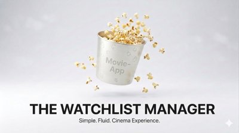

<p align="center">
  
</p>

# Movie-App
### The Watchlist Manager

> Build and manage your personal movie database — powered by the OMDb API.

---

## What it does

Movie-App lets you search for any film and save it to your personal database,
complete with title, year, rating and poster. Generate a website from your 
collection, visualize your ratings, or just let the app pick your next watch.

---

## Features

| | |
|---|---|
| 🔍 Search & Add | Find any movie via the OMDb API |
| ✏️ Update | Set your own personal rating |
| 🗑️ Delete | Remove movies from your list |
| 🎲 Random Pick | Can't decide? Let the app choose |
| 🔎 Filter & Sort | By title, rating, or year |
| 📈 Histogram | Visualize your rating distribution |
| 🌐 Website | Generate a movie website from your database |

---

## Getting Started

**1. Clone the repository**
```bash
git clone https://github.com/MalteNeeGit/Movie-App.git
cd Movie-App
```

**2. Install dependencies**
```bash
pip install -r requirements.txt
```

**3. Add your API key**

Create a `.env` file in the root directory:
```
API_KEY=your_omdb_api_key_here
```
→ Get your free key at [omdbapi.com](https://www.omdbapi.com/apikey.aspx)

**4. Run**
```bash
python main.py
```

---

## Tech Stack

`Python 3` · `SQLite` · `SQLAlchemy` · `OMDb API` · `Matplotlib` · `python-dotenv`

---

*Made by Malte Neemann*